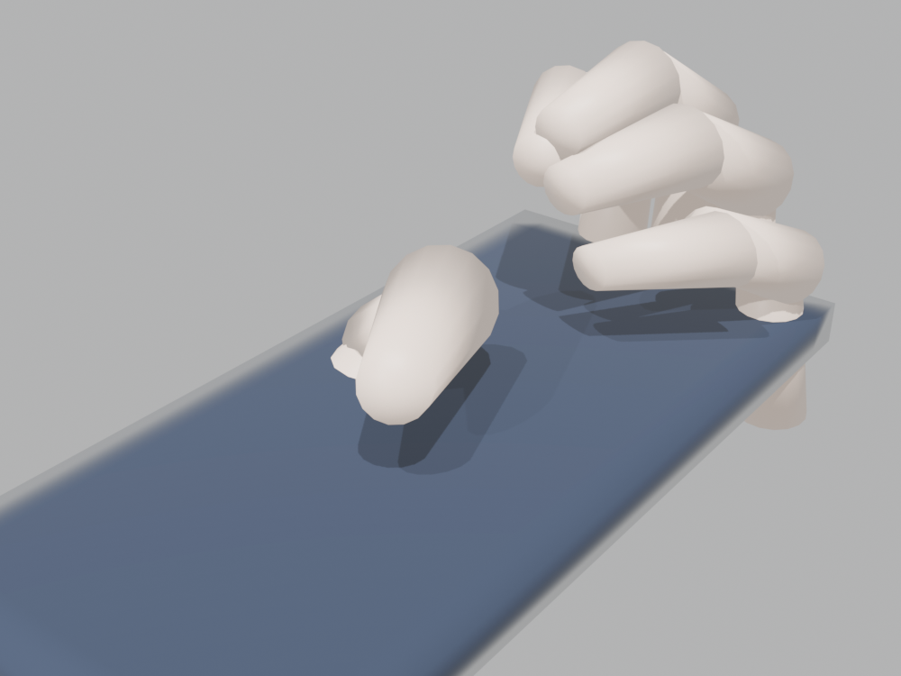
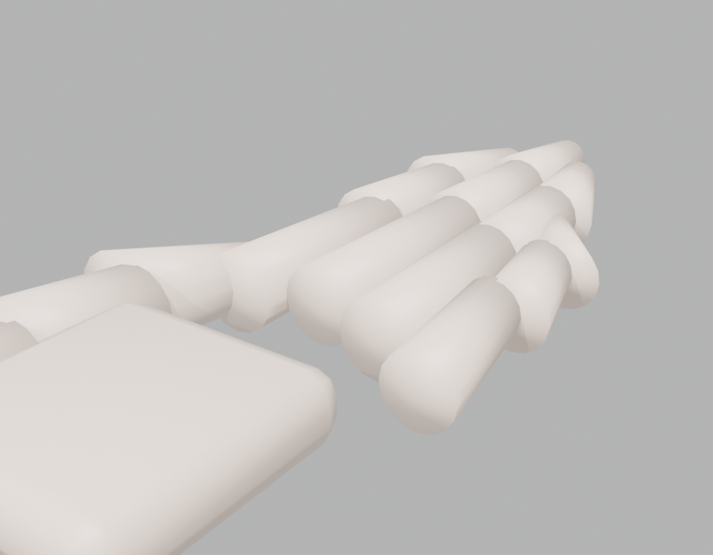
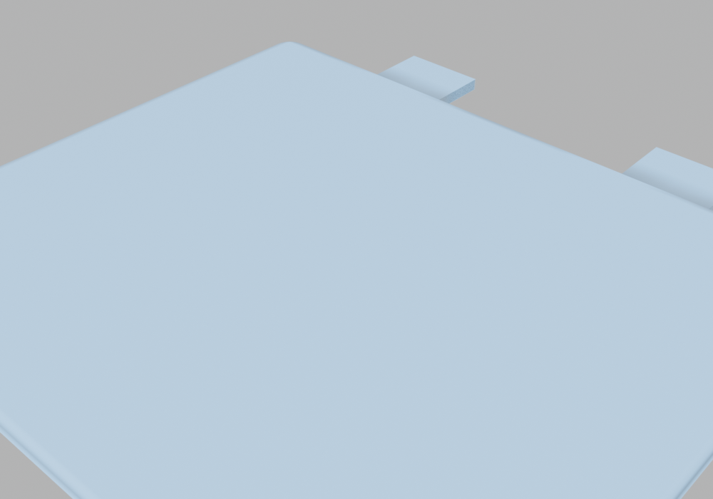

# DigitalTwinSimulation

LS-DYNA `.k` 메쉬 → 외곽 STL 추출 → 절차적 손 그립 포즈 → 폰 외곽 모핑(내부 스무싱) → 재해석 가능한 솔리드 `.k`. **LLM이 자연어로 지시하는 MCP 서버**로 노출.

스마트폰 드롭테스트의 "손이 폰을 쥔 상태" 시뮬레이션 입력을 자동 생성한다.



## 파이프라인

```
DYNA .k  →[extract]→  외곽 STL  →[load_hand→grip]→  손이 폰 쥠 + 편집외곽
                                                          │
                          재해석 가능 .k  ←[export]←  [morph] 편집외곽을 체적메쉬에 전파
```

| 절차적 손 (566정점) | 실제 배터리 셀 외곽 추출 (7000노드 혼합 메쉬) |
|:---:|:---:|
|  |  |

> 위 배터리는 `/data/battery_study`의 실제 배터리 .k(솔리드 4680 + 셸 7383 혼합)에서
> 외곽을 추출한 것. 합성 박스가 아니라 실물 혼합 메쉬에서 검증됨.

## 설치 (포터블 — 로컬 venv)

```bash
python3.13 -m venv .venv
.venv/bin/pip install -e .            # numpy/scipy
.venv/bin/pip install -e ".[mcp]"     # MCP 서버까지
```

모든 의존성은 프로젝트 `.venv` 안에 설치된다. Blender 4.5 LTS(`/snap/bin/blender`)가 손 생성/그립에 필요(환경변수 `DTS_BLENDER_BIN`으로 경로 지정 가능). 모핑/추출은 Blender 없이 numpy/scipy만으로 동작.

## CLI

```bash
# 외곽 STL만 추출
.venv/bin/dyna2stl phone.k phone_outer.stl

# 전체 파이프라인 1커맨드
.venv/bin/dts-pipeline phone.k phone_morphed.k --style natural
```

## MCP 서버 (LLM 자연어 지시)

```bash
.venv/bin/dts-mcp        # stdio MCP 서버 기동
```

Claude Desktop 등 MCP 클라이언트 설정 예 (실제 stdio 연결 검증됨):

```json
{
  "mcpServers": {
    "digital-twin": {
      "command": "/home/koopark/claude/DigitalTwinSimulation/.venv/bin/dts-mcp",
      "env": {
        "DTS_SESSION_DIR": "/tmp/dts_sessions",
        "DTS_BLENDER_BIN": "/snap/bin/blender"
      }
    }
  }
}
```

MCP 클라이언트가 붙으면 위 7개 도구가 노출되고, 자연어 지시("이 폰 오른손으로
쥐고 솔리드 뽑아줘")가 `extract_surface → load_hand → grip_phone → morph_phone →
export_solid_k` 시퀀스로 실행된다. stdio 프로토콜 전체 왕복은 `tests/test_mcp_client.py`로 검증.

### 도구 (7개, flat 인자)

| 도구 | 설명 |
|------|------|
| `extract_surface(k_file, session_id?, parts?, merge_shells?)` | .k → 외곽 STL + 원본 보존 |
| `inspect_k(k_file)` | PART 목록·요소타입 조사(자가수정용) |
| `load_hand(session_id?, handedness?)` | 절차적 리깅 손 생성 |
| `grip_phone(session_id?, style?)` | 손이 폰 쥠 → 편집외곽 산출 |
| `morph_phone(session_id?, method?, scale?)` | 편집외곽을 체적메쉬에 전파 |
| `export_solid_k(session_id?, out_path?)` | 모핑된 .k 내보냄 |

### 자연어 시나리오

> "이 폰 .k 오른손으로 쥐고 솔리드 .k 뽑아줘"

```
extract_surface(k_file="phone.k")          → session "default", phone_stage=extracted
load_hand(handedness="right")              → hand_stage=loaded
grip_phone(style="natural")                → hand_stage=gripped, phone_edited_outer 생성
morph_phone(method="laplacian")            → phone_stage=morphed (min_jacobian>0)
export_solid_k(out_path="phone_grip.k")    → 완료
```

요소가 뒤집히면(과한 변형) `morph_phone`이 실패하며 `scale`을 줄이라는 hint를 준다 — LLM이 자가수정 가능.

## 아키텍처 (DESIGN.md 참조)

- `dyna_io/` — .k 파싱(degenerate-tet 처리), 자유면/외부경계 추출, STL, .k 재작성. 순수 numpy.
- `morph/` — 변위장 조화확장(Laplacian), Jacobian 품질게이트, 거부 우선 드라이버. numpy/scipy.
- `blender_core/` — 절차적 손, 그립 포즈. bpy 전용(headless).
- `app/` — 세션 상태(폰/손 병렬트랙), 파이프라인, Blender 경계.
- `mcp_server/` — FastMCP 도구 표면. 코어는 mcp를 모른다.

설계 원칙: 최소 코드, 패턴은 두 번째 구현이 실재할 때만. 채택 패턴 = Strategy(morph), Adapter(blender).

## 테스트

```bash
.venv/bin/pytest -q     # 62 passed (Blender 없으면 일부 skip)
```
